摘要：

关键词：

[TOC]

#一、项目背景
#二、问题提出

#三、方案设想

便携式环境监测系统分为两个部分：

A. 第一个部分是一个传感器模块，它分为三个主要部分,这三个部分由一个控制器来进行整体控制：

1. 传感器组，包括PM2.5传感器、紫外传感器、甲醛传感器、温湿度传感器；
2. 电源，包括充电电路和稳压电路；
3. 蓝牙模块。
 
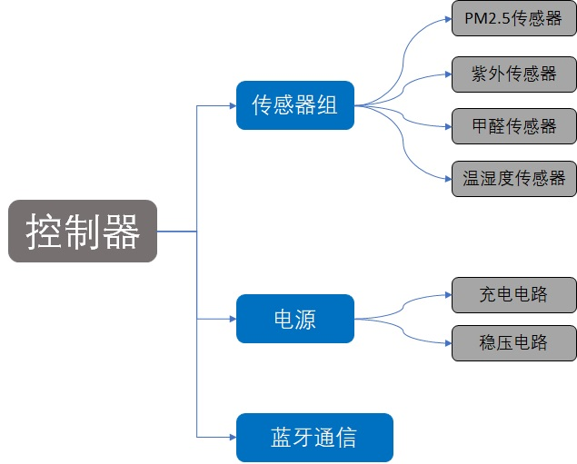 

B. 第二个部分是手机上的数据接收和报警功能部分，通过蓝牙让传感器模块和手机可以实时通讯。

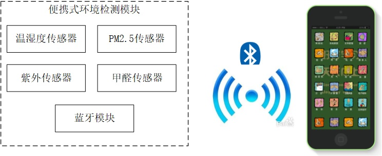 

<这里要不要也来个探讨设计灵感？>

#四、（软件）设计方案

便携式环境监测系统的方案设计成两部分：一是环境模块通过蓝牙与手机绑定，二是手机端启动环境监测与报警系统。

##（一）环境模块通过蓝牙与手机绑定

步骤1、启动环境模块，蓝牙开始广播；

步骤2、打开手机的蓝牙，在蓝牙配对界面点击搜索设备，并选中代表环境模块的设备，配对成功后，手机上的APP即可以接收数据。

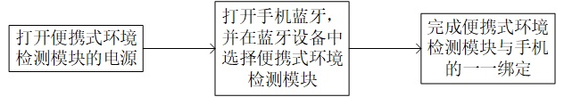

##（二）手机端启动环境监测与报警系统。

步骤1、启动环境模块，即开启蓝牙与手机连接，并开始通讯连接；

步骤2、环境模块将检测到的环境数据通过蓝牙传送到手机的APP上，APP随即显示当前的环境数据；

步骤3、手机APP判断当前环境是否对人体不利；

步骤4、若是，则APP推送警告信息，并在程序界面上显示建议通风或更换环境；若否，则重新回到步骤2；

步骤5、回到步骤2.

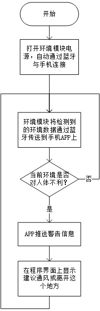

#五、（硬件设计方案）元器件采用
1、主控制器采用SiliconLabs公司的EFM32，它是一款超低功耗控制器，功耗只有目前常规产品的四分之一，在深度睡眠模式下耗电量为900nA，在关机模式下耗电量仅为20nA。并且，低于2μs 的启动时间使其电池寿命延长了至少4倍。并且功能丰富，控制器内部包含许多功能模块，可以通过简单的编程便实现相应功能。

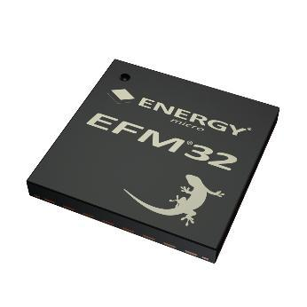

2、蓝牙模块采用采用深圳创思天地科技有限公司的ILT254x-A1低功耗蓝牙模块，采用TI的CC2540 作为核心处理器，模块运行在2.4GHz ISM band，2MHz的通道间隙能更好地防止相邻频道的干扰。同时，输出功率也可以根据需要调节。模块使用串口通信协议进行控制，几乎可以连接到各种单片机芯片，并完成无线数据传输工作，并且其工作时消耗的电流极低，为10mA级，掉电模式和待机模式下电流消耗更低。

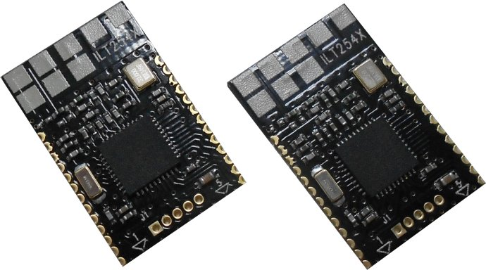

3、PM2.5传感器采用夏普的GP2Y1010AU0F，它是一款光学空气质量传感器，其内部对角安放着红外线发光二极管和光电晶体管，使得其能够探测到空气中尘埃反射光，即使非常细小的如烟草烟雾颗粒也能够被检测到，通常在空气净化系统中应用。体积小,重量轻,便于安装，成本低廉，非常适合用在这个项目中。

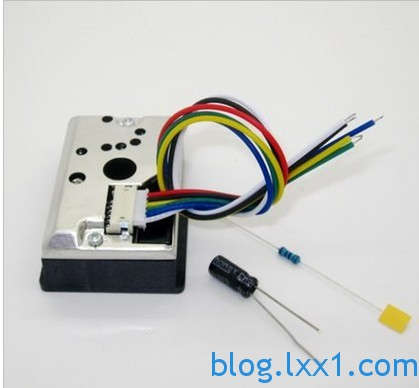

4、紫外传感器采用SiliconLabs公司的Si1132，该传感器IC可以在当前照射有害紫外线时发出警告，或计算在运动过程中累加的紫外线照射量。这种传感器对晒伤高风险的人群或担忧过度曝晒的人群极为有用。这个传感器的低功耗待机电流低于500nA，可以延长使用时间。

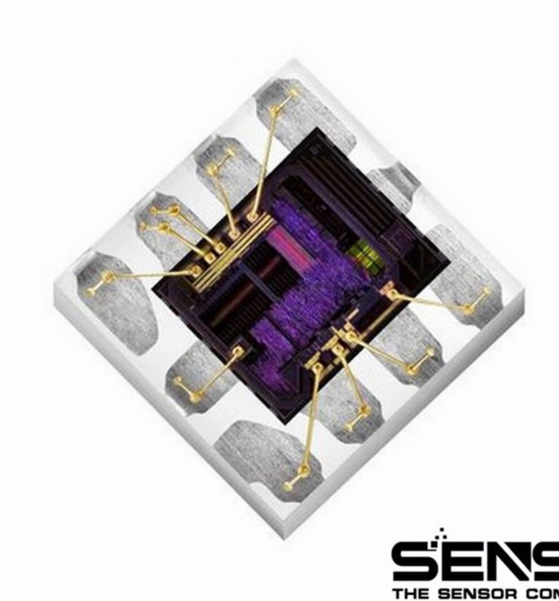

5、VOC传感器使用的是AMS的CCS811，可以用于大气污染监测、呼出酒精测量、有毒气体（如甲醛）检测等功能。该芯片基于金属氧化物敏感层，采用获专利保护的CMOS MEMS微型热平板技术制造而成，具有非常低的功耗：测量时为1.6mW。同时，这个传感器已经将算法集成在内部，通过IIC总线就可以进行数据读取，使用上非常方便。

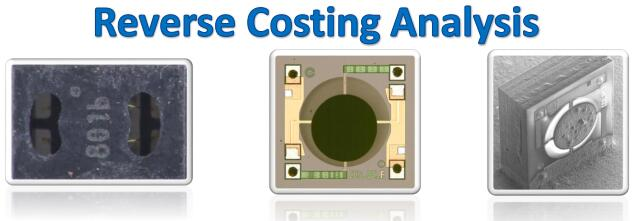

6、温湿度传感器采用SiliconLabs公司的Si7020，它使用集成电路的方法进行温湿度的检测，外形小巧，价格低廉，很适合在这里使用。它可以同时检测温度和湿度，检测精度高：±0.4 °C, ±4 %RH，测量范围广：温度
-10~+85°C，湿度 0~80%RH，出厂时就已经进行了校准，很适合在这个应用中使用。同时，极低的功耗（60nA）也使得整机的工作时间得以延长。

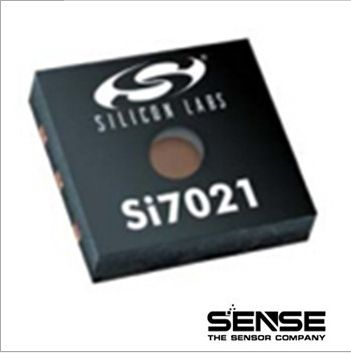

7、充电芯片采用TI的BQ24040，它体积比较小，外部电路比较少，使用方便。它可以由USB端口或交流适配器供电。带输入过压保护的高输入电压范围支持低成本、非稳压适配器。有名的小米充电宝里面使用的就是这款芯片，这足以证明这款芯片的性价比以及使用的简便程度。

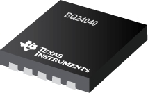

8、电源芯片使用TI的TPS63051，它是一款降压/升压转换器，适用于输入电压高于或低于输出电压的应用。效率比较高，可以达到95%以上，对延长使用时间很有帮助。同时，它可以在整个输入电压范围内针对输出电压进行稳压操作，可根据输入电压自动切换为降压或升压模式，从而在两种模式之间实现无缝转换。十分小巧的体积也让它容易集成到有限的空间中。

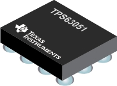

#六、电路与程序设计

##（一）电路设计

AltiumDesigner软件是世界著名的电路设计工具之一，它可用于原理图设计和电路板设计。

指导老师帮我安装和配置好了这套工具。在他的帮助下，我先建立了一系列原理图符号，然后在原理图中将这些符号连接起来，让它达到我需要的功能；验证过后导入电路板，在电路板工作区将元器件之间的线一根根连起来，在这个过程中老师告诉我电路板的设计并不是把两个管脚走通就可以了，而是要综合考虑成本、外形、可加工性等一系列因素。其中，由于需要将紫外传感器暴露在光照条件下，传感器需要尽可能地靠近外壳上开孔的位置；PM2.5传感器、温湿度传感器和VOC传感器因为有透气的需要，所以需要在电路板上挖一个洞，好让气流通过。

##（二）传感器检测程序

使用SiliconLabs公司的EFM32作为主控制器，并在ARM公司的Keil软件中进行程序的编写，其编程流程图如下：

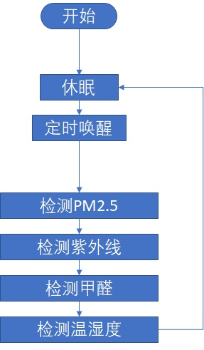

系统分为两个部分，第一个部分为初始化部分：这里声明5个变量，分别为：ucPM代表PM2.5的值，ucUV代表紫外线的值，ucVOC代表甲醛的值，ucTEMP代表温度的值，ucRH代表湿度值。

第二个部分为循环部分，程序默认工作在休眠状态以降低功耗。EFM32中有一个低功耗定时器，综合功耗和性能之后让它每隔一分钟进入一次定时器中断。每次进入中断后先执行中断里的任务，唤醒控制器。然后执行主函数中的读取程序，通过IIC总线依次读取紫外线、甲醛、温度、湿度；启动模数转换器读取PM2.5传感器的值。之后将读取到的数据打包好后通过蓝牙模块发送给手机。

##（三）手机端程序

作一些简要的介绍？

<此处是否该有图片？>

在指导老师的帮助下，我使用已经搭建好的某手机蓝牙接收程序，首先将手机上的蓝牙与传感器模块的蓝牙进行配对并绑定。绑定好传感器模块以后打开手机端APP，点击接收数据就可以实时读取数据。如果某一项数值超过报警值的话手机APP会有消息推送。

以上设计部分经样机系统各个模块联合调试后，功能符合设计要求，运行可靠。

#七、安装及场景测试
#八、实物图和可拓展的功能
#九、总结
#附件一 查新报告