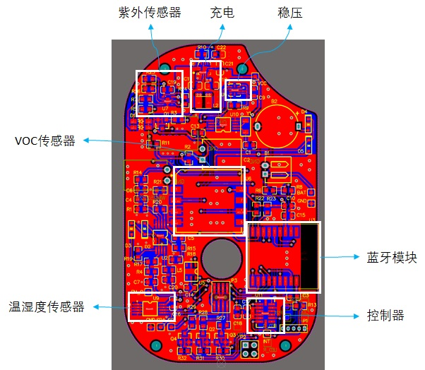

摘要：

关键词：

[TOC]

#一、项目背景

2017年12月29日，在新年钟声敲响前的几十个小时，我们迎来了今年冬天最重最快的一场雾霾。早晨起来后就看到外面都是雾蒙蒙的一片，直到中午也没有好转。新闻里到处是雾霾的报导：保定重度污染，AQI254;信阳重度污染，AOI282;兰州重度污染，AQI466......短短几分钟的新闻让我不寒而栗。

晚上回家的时候听说隔壁王叔叔的儿子因为一直不停地咳嗽住院了，爸爸妈妈都说是这雾霾天闹的。隔壁张阿姨家因为刚怀上小宝宝，怕刚装修的房子污染大，对孕妇不好，所以到现在也没回来住。于是我去网上查了一下，不查不知道，一查吓一跳，原来每年有170万例5岁以下儿童死亡与环境污染有关。据世界卫生组织发布的报告显示，全球五岁以下儿童的死亡中，其中约有四分之一与环境污染有关，如空气污染、二手烟雾等。

PM2.5和另外一些环境污染物也会影响宝宝与孕妇的身体健康：PM2.5会导致宝宝呼吸道感染、肺损伤、小儿佝偻病，像甲醛一类的装修污染气体也会导致孕妇体重降低，甚至增加宝宝畸形的概率。

以上新闻深深刺痛了我，虽然我对这些专业术语不是很了解，但是我知道环境问题正严重影响着小朋友们和准妈妈们的健康。我们生活在同一片天空下，依靠个人的力量很难在短时间内改变周围的环境质量......我陷入了程思中——我要发明一个监控和报警装置，实时监控使用者周围的环境，一旦环境变得对人体有害，它就会报警并提醒使用者离开当前环境或者开窗通风。

根据我的日常观察，生活中最常见的有关环境的设备就是空气净化器了，但是空气净化器体积比较大，无法随身携带；而且空气净化器主要是设计为接电源使用的，内部的传感器功耗大多比较大，如果直接使用的话续航时间会比较短。

在老师的知道下我又查询了现阶段已有的便携式环境监测系统专利，现有设计的缺陷主要有以下几点：**第一，没有甲醛等污染物的检测功能，适用范围比较窄。**例如中国专利CN201620467807U公开了一种声光报警的便携式空气质量检测仪，检测仪主体上设置有空气检测头，空气检测头与设置在检测仪主体内部的颗粒物传感器模块、温湿度传感器模块和烟雾传感器模块相连；检测仪主体的一个面上设置有声光报警模块和触摸屏，检测仪主体的内部还设置有控制电路，颗粒物传感器模块、温湿度传感器模块、烟雾传感器模块、声光报警模块和触摸屏均与控制电路相连。只有颗粒物检测，没有甲醛等污染物的检测功能，在室内条件下使用效果不好。**第二，功耗比较高，充电完成后使用时间短。**例如中国专利CN201710280919A本发明公开了一种家用空气污染分级预警装置及方法，该装置包括用于供电的电源模块以及空气采样模块、GPS信息传输模块、分级预警模块、存储模块、显示输出模块，根据用户所在区域当日的空气质量指数和历史空气质量指数，对当日的空气质量进行分级预警。本发明主要从空气质量相对优劣的角度出发，通过算法使划分的质量级别与人群健康受环境污染影响的相对程度相联系，考虑了不同等级的环境质量引起的环境效应，并将预警结果显示给公众。使用了功耗较高的GPS，续航时间短，频繁的充电不利于产品的推广和使用。**第三，没有连接手机，可拓展行比较差。**例如中国专利CN201720116007U公开了一种便携式空气质量检测仪，它涉及电子信息技术领域；所述壳体上安装有光伏电池板，所述壳体的中部安装有数个进风管，所述进风管的内侧安装有空气质量检测芯片，所述壳体的内部分别安装有信号转换器、蓄电池，所述壳体的左侧安装有指示灯，所述壳体的后端安装有弹性夹，所述光伏电池板通过导线与蓄电池的充电端连接，所述蓄电池的供电端与空气质量检测芯片的电源端连接，所述空气质量检测芯片的输出端通过导线与信号转换器的输入端连接，所述信号转换器的输出端通过导线与指示灯连接。它不连接手机，无法进行软件升级以及以后的功能拓展。以身边的使用环境来看，我从未在生活中看到过检索到的专利技术产品或设计，这些专利产品要么功能单一市场前景不好，要么实现方式太难，需要花费的成本太高，它的价值也就大打折扣了。

#二、问题提出

如何找到一种简便易行的方法，让人们尤其是孕妇可以远离受污染的环境，同时又可以随身携带呢？我的设想是设计一种报警装置，一旦使用者周围的环境发生了变化，可能对人们产生不利的影响时就发出警告信息并通过手机推送，提示危险并建议使用者离开当前环境或开窗通风。但是，这样的设备要做成什么样子呢？我一开始想做成手机壳，灵感来源于生活中经常看到很多人都会给手机套上一个很大的外壳，这个外壳的空间可以充分利用起来。

最初的想法难免会有局限性，为了完善我的设计，我继续在网上搜寻有关信息。近年来虽然智能硬件的发展非常迅速，但是传感器的使用却有着许多的限制：PM2.5传感器和化学传感器需要有一个可以通风的结构；网上找到的电化学传感器体积都比较大，而且使用寿命比较短，约一年就要更换新的传感器。面对这种情况，我的想法是做一个小巧的挂件，可以挂在包上或者钥匙圈上，这样用户就可以随身、随时、随地地进行环境空气质量及报警了。

我决定把我的想法告诉辅导老师。老师告诉我，我们的生活正随着科技的发展日新月异，特别是在网络和智能技术发展的驱动下，智能硬件无疑成为了一大热点，推动者相关电子产业的快速增长。其中，蓝牙等通信技术是智能硬件最重要的核心技术支撑，它体积小巧、使用简便、可以非常方便地和手机等设备连接。

蓝牙低能耗(BLE)技术是低成本、短距离、可互操作的鲁棒性无线技术，工作在免许可的2.4GHz ISM射频频段。有BLE4.0, BLE4.1, BLE4.2, BLE5.0等多个协议版本。它从一开始就设计为超低功耗(ULP)无线技术。它利用许多智能手段最大限度地降低功耗。蓝牙低能耗技术采用可变连接时间间隔，这个间隔根据具体应用可以设置为几毫秒到几秒不等。另外，因为BLE技术采用非常快速的连接方式，因此平时可以处于“非连接”状态（节省能源），此时链路两端相互间只是知晓对方，只有在必要时才开启链路，然后在尽可能短的时间内关闭链路。

智能硬件的另一个重要组成部分就是传感器了，现在的传感器技术也是日新月异，新的传感器有许多以往传感器所没有的新功能，基于金属氧化物的VOC传感器就是其中一类。

VOC是挥发性有机化合物（volatile organic compounds）的英文缩写。普通意义上的VOC就是指挥发性有机物，包括甲醛、苯、甲苯等气体。VOC传感器是使用金属氧化物催化剂在高温下催化VOC与氧气反应，并在这个过程中改变电阻率而进行测量的传感器。新型的VOC传感器基于微加工工艺，降低了功耗，增加了灵敏度。

目标渐渐清晰：我要做一个符合现代潮流、顺应时代发展和现代人生活习惯的，价格低廉且使用时间长的，便于携带的多功能便携式环境监测仪。

#三、方案设想

便携式环境监测系统分为两个部分：

A. 第一个部分是一个传感器模块，它分为三个主要部分,这三个部分由一个控制器来进行整体控制：

1. 传感器组，包括PM2.5传感器、紫外传感器、甲醛传感器、温湿度传感器；
2. 电源，包括充电电路和稳压电路；
3. 蓝牙模块。

B. 第二个部分是手机上的数据接收和报警功能部分，通过蓝牙让传感器模块和手机可以实时通讯。

<这里要不要也来个探讨设计灵感？>

#四、（软件）设计方案

便携式环境监测系统的方案设计成两部分：一是环境模块通过蓝牙与手机绑定，二是手机端启动环境监测与报警系统。

##（一）环境模块通过蓝牙与手机绑定

步骤1、启动环境模块，蓝牙开始广播；

步骤2、打开手机的蓝牙，在蓝牙配对界面点击搜索设备，并选中代表环境模块的设备，配对成功后，手机上的APP即可以接收数据。

##（二）手机端启动环境监测与报警系统。

步骤1、启动环境模块，即开启蓝牙与手机连接，并开始通讯连接；

步骤2、环境模块将检测到的环境数据通过蓝牙传送到手机的APP上，APP随即显示当前的环境数据；

步骤3、手机APP判断当前环境是否对人体不利；

步骤4、若是，则APP推送警告信息，并在程序界面上显示建议通风或更换环境；若否，则重新回到步骤2；

步骤5、回到步骤2.

#五、（硬件设计方案）元器件采用
1、主控制器采用SiliconLabs公司的EFM32，它是一款超低功耗控制器，功耗只有目前常规产品的四分之一，在深度睡眠模式下耗电量为900nA，在关机模式下耗电量仅为20nA。并且，低于2μs 的启动时间使其电池寿命延长了至少4倍。并且功能丰富，控制器内部包含许多功能模块，可以通过简单的编程便实现相应功能。

2、蓝牙模块采用采用深圳创思天地科技有限公司的ILT254x-A1低功耗蓝牙模块，采用TI的CC2540 作为核心处理器，模块运行在2.4GHz ISM band，2MHz的通道间隙能更好地防止相邻频道的干扰。同时，输出功率也可以根据需要调节。模块使用串口通信协议进行控制，几乎可以连接到各种单片机芯片，并完成无线数据传输工作，并且其工作时消耗的电流极低，为10mA级，掉电模式和待机模式下电流消耗更低。

3、PM2.5传感器采用夏普的GP2Y1010AU0F，它是一款光学空气质量传感器，其内部对角安放着红外线发光二极管和光电晶体管，使得其能够探测到空气中尘埃反射光，即使非常细小的如烟草烟雾颗粒也能够被检测到，通常在空气净化系统中应用。体积小,重量轻,便于安装，成本低廉，非常适合用在这个项目中。

4、紫外传感器采用SiliconLabs公司的Si1132，该传感器IC可以在当前照射有害紫外线时发出警告，或计算在运动过程中累加的紫外线照射量。这种传感器对晒伤高风险的人群或担忧过度曝晒的人群极为有用。这个传感器的低功耗待机电流低于500nA，可以延长使用时间。

5、VOC传感器使用的是AMS的CCS811，可以用于大气污染监测、呼出酒精测量、有毒气体（如甲醛）检测等功能。该芯片基于金属氧化物敏感层，采用获专利保护的CMOS MEMS微型热平板技术制造而成，具有非常低的功耗：测量时为1.6mW。同时，这个传感器已经将算法集成在内部，通过IIC总线就可以进行数据读取，使用上非常方便。

6、温湿度传感器采用SiliconLabs公司的Si7020，它使用集成电路的方法进行温湿度的检测，外形小巧，价格低廉，很适合在这里使用。它可以同时检测温度和湿度，检测精度高：±0.4 °C, ±4 %RH，测量范围广：温度
-10~+85°C，湿度 0~80%RH，出厂时就已经进行了校准，很适合在这个应用中使用。同时，极低的功耗（60nA）也使得整机的工作时间得以延长。

7、充电芯片采用TI的BQ24040，它体积比较小，外部电路比较少，使用方便。它可以由USB端口或交流适配器供电。带输入过压保护的高输入电压范围支持低成本、非稳压适配器。有名的小米充电宝里面使用的就是这款芯片，这足以证明这款芯片的性价比以及使用的简便程度。

8、电源芯片使用TI的TPS63051，它是一款降压/升压转换器，适用于输入电压高于或低于输出电压的应用。效率比较高，可以达到95%以上，对延长使用时间很有帮助。同时，它可以在整个输入电压范围内针对输出电压进行稳压操作，可根据输入电压自动切换为降压或升压模式，从而在两种模式之间实现无缝转换。十分小巧的体积也让它容易集成到有限的空间中。

#六、电路与程序设计

##（一）电路设计

AltiumDesigner软件是世界著名的电路设计工具之一，它可用于原理图设计和电路板设计。

指导老师帮我安装和配置好了这套工具。在他的帮助下，我先建立了一系列原理图符号，然后在原理图中将这些符号连接起来，让它达到我需要的功能；验证过后导入电路板，在电路板工作区将元器件之间的线一根根连起来，在这个过程中老师告诉我电路板的设计并不是把两个管脚走通就可以了，而是要综合考虑成本、外形、可加工性等一系列因素。其中，由于需要将紫外传感器暴露在光照条件下，传感器需要尽可能地靠近外壳上开孔的位置；PM2.5传感器、温湿度传感器和VOC传感器因为有透气的需要，所以需要在电路板上挖一个洞，好让气流通过。

##（二）传感器检测程序

使用SiliconLabs公司的EFM32作为主控制器，并在ARM公司的Keil软件中进行程序的编写，其编程流程图如下：

<要不要引用一些代码？>

系统分为两个部分，第一个部分为初始化部分：这里声明5个变量，分别为：ucPM代表PM2.5的值，ucUV代表紫外线的值，ucVOC代表甲醛的值，ucTEMP代表温度的值，ucRH代表湿度值。

第二个部分为循环部分，程序默认工作在休眠状态以降低功耗。EFM32中有一个低功耗定时器，综合功耗和性能之后让它每隔一分钟进入一次定时器中断。每次进入中断后先执行中断里的任务，唤醒控制器。然后执行主函数中的读取程序，通过IIC总线依次读取紫外线、甲醛、温度、湿度；启动模数转换器读取PM2.5传感器的值。之后将读取到的数据打包好后通过蓝牙模块发送给手机。

##（三）手机端程序

作一些简要的介绍？

<此处是否该有图片？>

在指导老师的帮助下，我使用已经搭建好的某手机蓝牙接收程序，首先将手机上的蓝牙与传感器模块的蓝牙进行配对并绑定。绑定好传感器模块以后打开手机端APP，点击接收数据就可以实时读取数据。如果某一项数值超过报警值的话手机APP会有消息推送。

以上设计部分经样机系统各个模块联合调试后，功能符合设计要求，运行可靠。

#七、实际佩戴使用

<拍两张安装和焊接的照片？？>

佩戴便携式环境监测仪：将便携式环境监测仪挂在妈妈的包上，连接手机蓝牙后等待数据传输到手机上。

<截一个环境模块挂在包上的图片？？>

<来个数据图表，显示多组数据？？>

<对数据做一下描述>

<来个手机截图？？>

#八、实物图和可拓展的功能

##（一）实物图片

##（二）待开发的功能

此次设计只完成了部分设想，我觉得在环境检测功能实现的基础上还可以进行深度开发，实现以下拓展功能：

**1.更长的续航时间**

现在的便携式环境监测仪充满电后可以连续使用3~4天，使用者告诉我太频繁的充电会让他觉得使用不方便，如果可以像小米手环一样充一次电就用一个月就可以让使用更加方便。

**2.更多的传感器**

虽然便携式环境监测仪可以检测5种传感器的数据，但是使用者跟我反映说觉得还是有点少，毕竟像电磁波，辐射等参数对人体也有很大的危害，如果可以检测出来，那么使用范围就会更广了。

**3.加入智能识别的功能**

试验中发现在一些特殊场合有一些参数之间是有相关性的，比如温度不变的时候，如果湿度逐渐增加到了70%，那么很有可能是外面下雨了，以此为依据可以智能识别出外在环境并作出提示，这将是一个很有用的功能。

**4.手机端需要更好的人机交互界面**

由于这个便携式环境监测仪主要是面向孕妇等人群，她们对于图形界面有着较高的要求。当前界面单单显示数值会让人枯燥乏味，如果可以加上一些卡通图案和一些有特色的曲线或图表的话，就可以让人使用起来更加舒心和顺手。

**5.手机云端大数据功能**

最近比较流行大数据，我有时候也在想，如果可以把很多环境监测仪的数据都上传到云端的话，通过云端的大数据功能，就可以形成一张比较详细的周围环境质量地图。那么在使用者靠近受污染的区域前就可以提醒他们远离此区域。

#九、总结

从看到高污染引发雾霾天的新闻开始，引起我的深思并着手研究解决问题，再到具体设想的提出，并在搜索引擎和老师的指导下，分析现有产品缺陷、学习未来发展趋势，进一步提出并形成设计一个多功能便携式环境监测仪的想法，再到之后元器件选用、程序编写、系统调试，我遇到了很多很多的问题，但是这些问题并没有成为拦路虎，都在老师的指导下一一解决了。我认为，这个项目的设计具有相当的实用性，提供了一个便于携带、功能丰富的报警方案，成品更可以投入实际生活中使用，大大减少使用者接触环境污染物的可能性。

我从这次设计中得到的最大收茯是：如何在生活中发现问题获得设计灵感，如何以现实需求为导向完善创意，如何借助更专业的力量来弥补自己现阶段能力不足的短板以达到完成设计的目的，这些经验将使我受益终生。 

我将在老师的指导下继续进行深入研究，进一步完善系统，增加拓展功能，使它更加智能、强大，并在时机成熟时，委托柜关企业投入模型的开发和产品的批量作，推广进入市场，造福社会。

#附件一 查新报告

素材 

1. CN201620467807U_一种声光报警的便携式空气质量检测仪

没有甲醛等有机气体的传感器，使用范围比较小。

公开了一种声光报警的便携式空气质量检测仪，检测仪主体上设置有空气检测头，空气检测头与设置在检测仪主体内部的颗粒物传感器模块、温湿度传感器模块和烟雾传感器模块相连；检测仪主体的一个面上设置有声光报警模块和触摸屏，检测仪主体的内部还设置有控制电路，颗粒物传感器模块、温湿度传感器模块、烟雾传感器模块、声光报警模块和触摸屏均与控制电路相连。

2. CN201720116007U_一种便携式空气质量检测仪

不能连接手机，功能限制比较多

公开了一种便携式空气质量检测仪，它涉及电子信息技术领域；所述壳体上安装有光伏电池板，所述壳体的中部安装有数个进风管，所述进风管的内侧安装有空气质量检测芯片，所述壳体的内部分别安装有信号转换器、蓄电池，所述壳体的左侧安装有指示灯，所述壳体的后端安装有弹性夹，所述光伏电池板通过导线与蓄电池的充电端连接，所述蓄电池的供电端与空气质量检测芯片的电源端连接，所述空气质量检测芯片的输出端通过导线与信号转换器的输入端连接，所述信号转换器的输出端通过导线与指示灯连接。

3. CN201620031618U_一种智能便携式空气质量检测装置

说便携，其实根本不便携

公开了一种智能便携式空气质量检测装置，包括检测装置和控制台，所述检测装置上端两侧分别设有温度检测装置和信号发射装置，所述检测装置下端一侧设有第一USB接口，所述检测装置内设有中央处理器、工作电源和空气检测装置，所述空气检测装置内两侧设有滑轨，所述空气检测装置通过滑轨与滑轮连接，所述滑轮一侧安装有收集盒，所述空气检测装置内设有检测传感器，所述检测传感器为多组。

4. CN201710280919A_一种家用空气污染分级预警装置及方法

使用GPS功耗比较高，续航时间短

本发明公开了一种家用空气污染分级预警装置及方法，该装置包括用于供电的电源模块以及空气采样模块、GPS信息传输模块、分级预警模块、存储模块、显示输出模块，根据用户所在区域当日的空气质量指数和历史空气质量指数，对当日的空气质量进行分级预警。本发明主要从空气质量相对优劣的角度出发，通过算法使划分的质量级别与人群健康受环境污染影响的相对程度相联系，考虑了不同等级的环境质量引起的环境效应，并将预警结果显示给公众。

5. CN201621435476U-一种便携式室外空气质量检测箱

专业仪器，体积比较大

本实用新型公开了一种便携式室外空气质量检测箱，包括可分别置物的矩形状的箱体和箱盖，箱体内设置有检测主机和剂量计，箱盖内设置有支架和隔板，支架置于隔板与箱盖形成的储物空间内，箱盖外顶面和箱体外底面上均设置有支撑脚，支撑脚均设置为可伸缩可折叠状。本实用新型一种便携式室外空气质量检测箱，解决现有技术中要单独携带支架的问题，解决现有技术中，检测装置检测时放置的问题，解决现有技术中一次只能检测一组空气数据的问题。

>http://toutiao.chinaso.com/rd/detail/20171230/1000200032975961514612111729384790_1.html
>http://finance.sina.com.cn/roll/2017-03-19/doc-ifycnpvh4929171.shtml