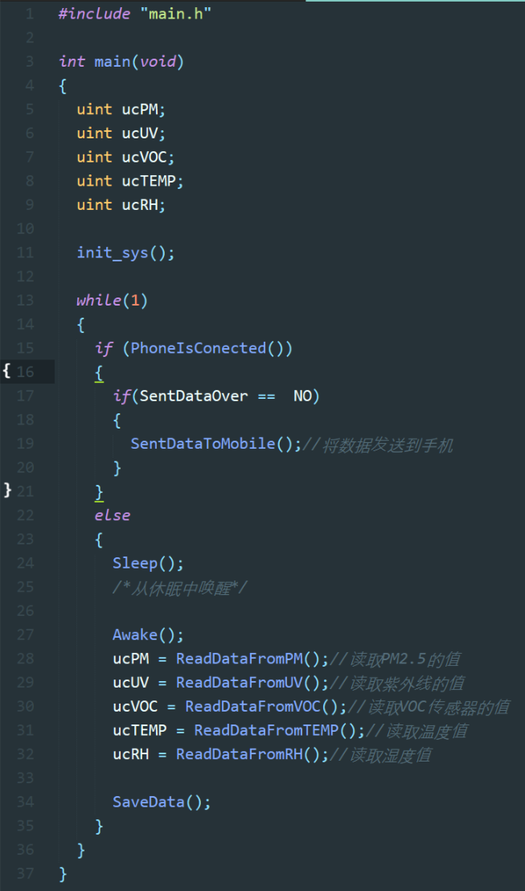
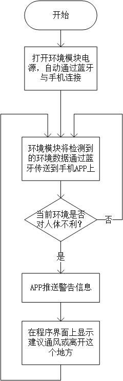

**摘要：**利用无人机进行环境信息检测虽然处于起步阶段，但其机动性强，自由度高，检测路径灵活，对大气污染的预防以及应急监测具有重要意义。我们可以利用它的这些优势，在其上装备传感装置，来探测低空污染物的种类和分布。本研究旨在以浙大玉泉校区为研究区域，利用搭载智能传感器硬件平台及微型质谱采样平台的四旋翼无人机（“大疆 Phantom Vision2+”）系统，设计了PM2.5，温湿度以及VOC的监测飞行路线和采集算法，并且对获得的数据进行了相关性分析。结果表明，玉泉校区PM10排放具有空间水平差异扩散特征。另外VOC传感器的数据表明，玉泉校区存在一定数量的的有机污染物聚集区。本研究是无人机在大气环境监测中的实际应用，能为后续污染物排放定期监管提供技术支持。

**关键词：**智能硬件 PM2.5 VOC 低功耗 蓝牙 无人机

[TOC]

#一、项目背景

2017年12月29日，在新年钟声敲响前的几十个小时，我们迎来了今年冬天最重最快的一场雾霾。早晨起来后就看到外面都是雾蒙蒙的一片，直到中午也没有好转。新闻里到处是雾霾的报导：保定重度污染，AQI254;信阳重度污染，AOI282;兰州重度污染，AQI466......短短几分钟的新闻让我不寒而栗。

图1 2017年12月29日雾霾污染报导

晚上回家的时候听说隔壁王叔叔的儿子因为一直不停地咳嗽住院了，爸爸妈妈都说是这雾霾天闹的。于是我去网上查了一下，不查不知道，一查吓一跳，每年有至少900万人因污染导致的疾病丧生，空气污染是头号杀手，室外和室内空气污染分别导致450万及290万人死亡，水源污染则导致每年180万人因消化道疾病和寄生虫感染死亡。

图2 每年有至少900万人因污染导致的疾病丧生

同时，PM2.5和另外一些环境污染物也会影响宝宝与孕妇的身体健康：PM2.5会导致宝宝呼吸道感染、肺损伤、小儿佝偻病，像甲醛一类的VOC也会导致孕妇体重降低，甚至增加宝宝畸形的概率。

图3 PM2.5危害

图4 VOC危害

以上新闻深深刺痛了我，虽然我对这些专业术语不是很了解，但是我知道环境问题正严重影响着人们的健康。我们生活在同一片天空下，依靠个人的力量很难在短时间内改变周围的环境质量......我陷入了程思中——怎样才能更加有效地监控周围的环境呢？

图5 高楼雾霾

随着城市人口密度的增加，现在的楼房也是越造越高。而传统环境质量的监测多为定点定时的地面监测，虽然有着可以提供连续一段时间内特定地点的污染物数据的优点，但是面对越来越高的建筑物，使用这种监测方法在提供不同高度范围的污染物浓度数值时需要建塔安装仪器，不仅耗费大量的人力物力，更有一定的危险性。

图6 大疆无人机

近几年无人机技术发展迅速，类似大疆这类品牌的无人机已经可以进入寻常百姓家。在之前的一次科学夏令营中，我与无人机有了一次亲密的接触，因此对无人机有一些了解。

而在本研究中使用无人机检测方法，正好与传统的地面监测形成互补。无人机操作便捷，机动性强，可以应对突发状况。其二，无人机可以停留在不同高度，采集三维的污染物浓度数据。我们可以利用它的这一优势，在其上装备多种传感设备，来探测低空污染物的种类。在选择采样点时更为灵活，可以自行设计、更改监测路径。

国际上，无人机用于环境监测的应用有很多，并且气体监测设备研究的技术更加成熟，美国MIDAC公司研发的Titan气体分析仪，MIDAC运用了通过气体测量池抽取与使用远程传感技术直接在空气中测量2种技术，针对污染源气团中不同的成分，浓度范围以及运行环境，使用仪器中不同的方法监测。国外已经开始进行了多无人机协同监测大气污染物的研究，多无人机协作系统根据运动过程中获取的传感器数据，利用相关地图建模算法生成环境地图，即建立污染气体的分布地图，从而获取系统监测污染气团的环境信息，为任务分配和路径规划提供基础。Cranfield University的Brian A. White教授领导的工作组利用无人机传感器网络监测污染物云的边界。他们使用无人机搭载传感器群对污染物云边界进行帧测、建模和绘图，然后使用这个模型预测污染物云的变化趋势。这种方法的优势在于：在计算云的边界时，只有顶点和段的曲率是必需的，而不是使用一个分布密度函数来表示分布。

美国Orbital Research机构的Michael A. Kovacina开发了一个基于一定规则的能应对紧急情况的搭载传感器无人机的分布策略，并且进行了验证：他们模拟了用无人机上传感器寻找和绘制无人区内污染物云的情况，并且考虑了几种不同的策略，在不考虑污染物云尺寸的情况下建立了无人机（传感器）群规模和发现污染物云所需时间的反线性关系，并且发现了无人机（传感器）群规模和侦测成功概率的线性关系。

近几年来，国内对于无人机应用的研究才刚刚开始，目前主要用于环境应急和简单的大气环境指标监测，指标主要包括：臭氧、粒子浓度、温度、湿度和二氧化氮等，如中国科学院大气物理研究所设计了两种型号的中型无人机，搭载了离子传感器和臭氧浓度传感器进行了探空实验，数据合理可信；中科院安徽光机所利用同种无人机搭载自发研究的大气污染差分吸收光谱探测系统，获得了二氧化氮等成分的时空分布。其中比较成熟的例子有环境保护部卫星环境应用中心的杨海军和中国科学院地理科学与资源研究所的黄耀欢利用无人机进行化工污染气体遥感监测。具体做法是：利用搭载有高分辨率相机和污染气体监测仪的旋翼无人机（“环鹰一号”）系统，结合地面核查验证的方式，设计了3 种污染气体污染遥感监测流程及方法。结果表明化工园区污染气体排放具有空间水平差异及垂直扩散特征。该研究结果联合水平和垂直异常值分析，能为提前排查污染源排放提供有效支撑。

但是，这些研究都有以下问题：

1. 这类研究大多使用专业仪器，而专业仪器大多比较笨重，需要中型或大型无人机才可以驼运；
2. 中型或大型的无人机大多造价高昂，并且使用不慎容易误伤，所以只适合在空旷场合使用，对于楼房密度高的住宅区并不适合；
3. 一些行业金标的测量方法自动化程度比较低，任然需要人工进行样品前处理；
4. 大多数研究的测量参数都比较丰富，但绝大多数参数主要用于学术研究，对人们的生活没有直接的意义，同时多出的检测器还会增加体积、重量进而进一步增加成本；

图7 关于需求的调查问卷

针对这些问题，我专门设计了问卷，调研并咨询了这方面的专家。问卷的结果比较明显：大多数人主要关心续航时间，成本售价，功能的丰富程度，这三类问题占了90%。另外还有10%左右的被调查对象觉得有一个人机交互界面可以及大地方便用户使用。其中我最奇怪的就是续航时间，因为无人机一块电池只能运行20m分钟左右，较长的续航时间对检测器是否真的有意义？后来他们告诉我正是由于无人机续航时间短所以才希望检测器续航时间可以长一点，毕竟要不断地换电池是一件很麻烦的事。

关于人机交互的界面，有两种方案可以选择：一种是内置的界面，另一种是外置的图形界面。综合便利程度与续航时间，一个外置的图形界面将会更加适合这个项目。

而由于传感器数量不少，检测器的续航时间至少要有24H，同时要兼顾体积，所以使用锂电池方案比较合适。

图8 关于功能的调查问卷

同时，我对产品所需要的具体功能做了统计。39%的用户比较关心化学污染物，33%的用户关心PM2.5污染，17%的被调查者觉得较高的温湿度対人体也不太好，另分别有5%和3%的用户觉得实时测一下紫外线和电磁场随高度的分布也许也有一定的意义。

#二、问题提出

如何找到一种简便易行的方法，既可以尽可能地检测更多参数，同时又便于无人机的挂载呢？检测器的续航时间要尽可能长，所以需要使用低功耗版本的传感器和控制器，所以我的设想是检测器上的东西越少越好，图形界面与数据处理放到电脑端执行。我一开始打算将数据存在本地，然后将数据通过USB上传到电脑进行处理。

最初的想法难免会有局限性，为了完善我的设计，我继续在网上搜寻有关信息。近年来虽然智能硬件的发展非常迅速，但是传感器的使用却有着许多的限制：PM2.5传感器和化学传感器需要有一个可以通风的结构；网上找到的电化学传感器体积都比较大，而且使用寿命比较短，约一年就要更换新的传感器。需要加载电池以保证尽可能地不破坏原有的无人机结构。

我决定把我的想法告诉辅导老师。老师告诉我，我们的生活正随着科技的发展日新月异，特别是在网络和智能技术发展的驱动下，智能硬件无疑成为了一大热点，推动者相关电子产业的快速增长。其中，蓝牙等通信技术是智能硬件最重要的核心技术支撑，它体积小巧、使用简便、可以非常方便地和手机等设备连接。

蓝牙低能耗(BLE)技术是低成本、短距离、可互操作的鲁棒性无线技术，工作在免许可的2.4GHz ISM射频频段。有BLE4.0, BLE4.1, BLE4.2, BLE5.0等多个协议版本。它从一开始就设计为超低功耗(ULP)无线技术。它利用许多智能手段最大限度地降低功耗。蓝牙低能耗技术采用可变连接时间间隔，这个间隔根据具体应用可以设置为几毫秒到几秒不等。另外，因为BLE技术采用非常快速的连接方式，因此平时可以处于“非连接”状态（节省能源），此时链路两端相互间只是知晓对方，只有在必要时才开启链路，然后在尽可能短的时间内关闭链路。

智能硬件的另一个重要组成部分就是传感器了，现在的传感器技术也是日新月异，新的传感器有许多以往传感器所没有的新功能，基于金属氧化物的VOC传感器就是其中一类。

VOC是挥发性有机化合物（volatile organic compounds）的英文缩写。普通意义上的VOC就是指挥发性有机物，包括甲醛、苯、甲苯等气体。VOC传感器是使用金属氧化物催化剂在高温下催化VOC与氧气反应，并在这个过程中改变电阻率而进行测量的传感器。新型的VOC传感器基于微加工工艺，降低了功耗，增加了灵敏度。

目标渐渐清晰：检测器仅保留控制器，传感器，电源等部分。通讯使用BLE代替USB以降低功耗，并且省略了重复插拔的过程，同时也不用携带笨重的电脑，仅使用手机就可以完成整个实验。

#三、方案设想

环境检测器分为两个部分：

A. 第一个部分是一个传感器模块，它分为三个主要部分,这三个部分由一个控制器来进行整体控制：

1. 传感器组，包括PM2.5传感器、甲醛传感器、温湿度传感器；
2. 电源，包括充电电路和稳压电路；
3. 蓝牙模块。

图9 系统框图

B. 第二个部分是手机上的数据接收和报警功能部分，通过蓝牙让传感器模块和手机可以实时通讯。

图10 便携式环境监测系统连接手机

图11 探讨设计灵感

#四、电路与程序设计

##（一）元器件采用

1、主控制器采用SiliconLabs公司的EFM32，它是一款超低功耗控制器，功耗只有目前常规产品的四分之一，在深度睡眠模式下耗电量为900nA，在关机模式下耗电量仅为20nA。并且，低于2μs 的启动时间使其电池寿命延长了至少4倍。并且功能丰富，控制器内部包含许多功能模块，可以通过简单的编程便实现相应功能。

图12 主控制器

2、蓝牙模块采用采用深圳创思天地科技有限公司的ILT254x-A1低功耗蓝牙模块，采用TI的CC2540 作为核心处理器，模块运行在2.4GHz ISM band，2MHz的通道间隙能更好地防止相邻频道的干扰。同时，输出功率也可以根据需要调节。模块使用串口通信协议进行控制，几乎可以连接到各种单片机芯片，并完成无线数据传输工作，并且其工作时消耗的电流极低，为10mA级，掉电模式和待机模式下电流消耗更低。

图13 蓝牙模块

3、PM2.5传感器采用夏普的GP2Y1010AU0F，它是一款光学空气质量传感器，其内部对角安放着红外线发光二极管和光电晶体管，使得其能够探测到空气中尘埃反射光，即使非常细小的如烟草烟雾颗粒也能够被检测到，通常在空气净化系统中应用。体积小,重量轻,便于安装，成本低廉，非常适合用在这个项目中。

图14 PM2.5传感器

4、VOC传感器使用的是AMS的CCS811，可以用于大气污染监测、呼出酒精测量、有毒气体（如甲醛）检测等功能。该芯片基于金属氧化物敏感层，采用获专利保护的CMOS MEMS微型热平板技术制造而成，具有非常低的功耗：测量时为1.6mW。同时，这个传感器已经将算法集成在内部，通过IIC总线就可以进行数据读取，使用上非常方便。

图16 VOC传感器

5、温湿度传感器采用SiliconLabs公司的Si7020，它使用集成电路的方法进行温湿度的检测，外形小巧，价格低廉，很适合在这里使用。它可以同时检测温度和湿度，检测精度高：±0.4 °C, ±4 %RH，测量范围广：温度
-10~+85°C，湿度 0~80%RH，出厂时就已经进行了校准，很适合在这个应用中使用。同时，极低的功耗（60nA）也使得整机的工作时间得以延长。

图17 温湿度传感器

6、充电芯片采用TI的BQ24040，它体积比较小，外部电路比较少，使用方便。它可以由USB端口或交流适配器供电。带输入过压保护的高输入电压范围支持低成本、非稳压适配器。有名的小米充电宝里面使用的就是这款芯片，这足以证明这款芯片的性价比以及使用的简便程度。

图18 充电芯片

7、电源芯片使用TI的TPS63051，它是一款降压/升压转换器，适用于输入电压高于或低于输出电压的应用。效率比较高，可以达到95%以上，对延长使用时间很有帮助。同时，它可以在整个输入电压范围内针对输出电压进行稳压操作，可根据输入电压自动切换为降压或升压模式，从而在两种模式之间实现无缝转换。十分小巧的体积也让它容易集成到有限的空间中。

图19 供电芯片

##（二）电路设计

AltiumDesigner软件是世界著名的电路设计工具之一，它可用于原理图设计和电路板设计。

指导老师帮我安装和配置好了这套工具。在他的帮助下，我先建立了一系列原理图符号，然后在原理图中将这些符号连接起来，让它达到我需要的功能；验证过后导入电路板，在电路板工作区将元器件之间的线一根根连起来，在这个过程中老师告诉我电路板的设计并不是把两个管脚走通就可以了，而是要综合考虑成本、外形、可加工性等一系列因素。其中，由于需要将紫外传感器暴露在光照条件下，传感器需要尽可能地靠近外壳上开孔的位置；PM2.5传感器、温湿度传感器和VOC传感器因为有透气的需要，所以需要在电路板上挖一个洞，好让气流通过。

图20 原理图1

图21 原理图2

图22 PCB设计图

##（三）传感器检测程序

使用SiliconLabs公司的EFM32作为主控制器，并在ARM公司的Keil软件中进行程序的编写，其编程流程图如下：

图23 系统流程图

系统分为两个部分，第一个部分为初始化部分：这里声明5个变量，分别为：ucPM代表PM2.5的值，ucUV代表紫外线的值，ucVOC代表甲醛的值，ucTEMP代表温度的值，ucRH代表湿度值。

第二个部分为循环部分，程序默认工作在休眠状态以降低功耗。EFM32中有一个低功耗定时器，综合功耗和性能之后让它每隔10s进入一次定时器中断。每次进入中断后先执行中断里的任务，唤醒控制器。然后执行主函数中的读取程序，通过IIC总线依次读取紫外线、甲醛、温度、湿度；启动模数转换器读取PM2.5传感器的值，并将传感器的数值保存到芯片内部的存储空间中。落地后将读取到的数据打包好后通过蓝牙模块发送给手机。

图24 代码展示

#五、软件设计方案

检测器系统的方案设计分成两部分：一是检测器通过蓝牙与手机绑定，二是手机端数据读取。

##（一）环境模块通过蓝牙与手机绑定

步骤1、启动环境模块，蓝牙开始广播；

步骤2、打开手机的蓝牙，在蓝牙配对界面点击搜索设备，并选中代表环境模块的设备，配对成功后，手机上的APP即可以接收数据。

图25 设备绑定流程图

##（二）手机端数据读取。

步骤1、启动检测器，即开启蓝牙与手机连接，并开始通讯连接；

步骤2、检测器将检测到的环境数据通过蓝牙传送到手机的APP上；

步骤3、手机APP判断当前数据是否已读取完毕；

步骤4、若是，则APP在程序界面上显示已读取并保存数据；若否，则重新回到步骤2；

步骤5、回到步骤2.

图26 总体系统流程图

##（三）手机端程序

手机端APP的后台数据，检测器中的数据都暂时存储在这里，之后经过APP进行数据解析和显示。

图27 手机APP后台界面

在指导老师的帮助下，我使用已经搭建好的某手机蓝牙接收程序，首先将手机上的蓝牙与传感器模块的蓝牙进行配对并绑定。绑定好检测器以后打开手机端APP，点击接收数据就可以读取数据了。如果数据读取完毕的话APP就会有提醒的。

以上设计部分经样机系统各个模块联合调试后，功能符合设计要求，运行可靠。

#六、实际安装使用

##（一）焊接、组装与使用

图28 安装调试1

图29 安装调试2

##（二）实物图片

图30 实物图片1

本次污染气体监测的无人机遥感系统，由飞行平台（无人机）、飞行导航与控制系统（手机端APP、飞机遥控器）、地面监控系统（手机端APP）、数据传输系统（传感器蓝牙部分）4部分组成。

Phantom 2 Vision+四旋翼无人机：主要实验工具，用于搭载采样平台和传感器，一块电池续航时间20分钟左右。

图32 检测器安装到Phantom 2 Vision+四旋翼无人机

##（三）实验设计

本研究将手持智能微型传感器和质谱采样平台结合到四旋翼无人机（大疆 Phantom Vision2+）上，利用无人机在玉泉校区不同区域进行PM、温湿度数据的采集以及空气采样。将所得传感器的数据利用百度地图API绘制出污染物地图，并利用SPSS等软件进行相关性分析。

划分单位区域的方法：由于无人机飞行范围和续航时间的限制，我们决定选定玉泉校区为研究区域。这就带来一个问题：如何划分单位区域使得区域间的污染物数值具有比较明显的区别？首先，我们用无人机在校园内进行了实地测量，确定了校区内部的不同地方污染物的值是有明显区别的。第二，通过查阅资料我们发现，临街、工地或是湿润的地方污染物数值较大，我们根据这些理论，将玉泉校区划分为6部分进行研究。我们根据玉泉的地理环境和可疑的污染源：食堂、 实验室、工地、街道等等将校区分为六大部分，其中区域1为不临街宿舍区，区域2为临街宿舍区，区域3为临街食堂区，区域4为临街临工地区域，区域5有可疑PM污染源，高分子楼（实地测量得知）。区域6为不临街区域。

图33 校区内部的不同地方PM的值

图34 玉泉校区划分区域图

飞行路线：利用大疆无人机的自发动巡航功能。航点设置（图4），已知长度和无人机飞行速度，保证其在每个单位区域内停留时间至少有一分钟（传感器数采样时间间隔为一分钟，为了缩小误差，其读数是将间隔一分钟的两个数值平均）。

悬停高度：选择一般住宅楼的高度（2层：6m；4层：12m；6层：18m；8层：24m；12层：3m；），每个高度悬停1-2分钟，分别测污染物值。

图35 航点设置示意图

另外通过实地实验测量，无人机悬停的气流不会对PM2.5传感器的数据产生影响。

##（四）实验设计

首先划定浙江大学玉泉校区为研究范围，起飞降落地点选在非常空旷的操场草坪上。

进行实验之前五至六小时检查飞机电源、遥控器电源、中继器电源、传感器电源、空气泵电源和手机电源，确保正式实验之前充满电。

进行实验之前一至两个小时打开传感器，使其在测量时能够稳定工作。

来到实验场地后，分别打开无人机，遥控器和中继器。将遥控器上S2开关设置到GPS模式，手机连接中继器后打开APP-DJI  Vision，在自动巡航功能中设置航点，需要注意的是，第一个航点要设置在地面站正上方，否则飞行器攀爬时会斜飞，有撞到树木或是建筑物的可能。GPS常用8航点分别为：120.11962, 30.26642; 120.12042, 30.26808; 120.12107, 30.26939; 120.12303, 30.26893; 120.12239, 30.26754; 120.12179, 30.26578; 120.12084, 30.26383; 120.11874, 30.26449。巡航高度设置为50m。在出发前，确认传感器打开。

一次飞行的时间大概为十五分钟，此时需要关注手机上显示的飞机位置，记录下到达指定航点（观测点）的时间。当飞机与中继器之间有建筑物阻挡，或是飞机距离中继器距离过远（通常100m以外）时需要计算相邻两观测点之间的时间（大概为1分钟）。

飞机飞回返航点（地面站位置）后，将遥控器S2开关拨至手动控制模式，然后手动控制降落。然后用手机通过蓝牙连接传感器，读出环境信息数据。采样管中样品送至质谱分析仪中进行分析。

将数据上传至同组同学建立好的网站，该网站利用百度地图API可以自动绘制出污染物地图。利用它得到污染物在玉泉校区的水平分布。

##（五）实验结果

图37 实验原始数据

###1. 在玉泉校区内的水平分布

利用之前划分区域的方法，综合多次实地检测数据绘制出PM2.5、湿度、温度、VOC的水平分布图（如图），从中可以看出，湿度分布和PM以及VOC分布是具有一致性的，但是由于同一时间校园内温度差别不大（22-23摄氏度），所以看不出温度分布与PM以及VOC分布的相关性。可以看出，校园内PM以及VOC较高的两个区域分别为2号和5号区域。其中，区域2为临街宿舍区，区域5内有高分子楼，实验室较多，有可疑PM与VOC污染源。

图38 PM2.5水平分布

图39 湿度水平分布

图40 温度水平分布

图41 VOC水平分布

###2. PM和VOC在不同高度的分布

图42 PM2.5-高度原始数据

图43 VOC-高度原始数据

由图表可知，不同高度上PM2.5差距不大，6~30m范围内，同时、同地不同高度PM值基本不变。VOC的值虽然有一定的波动，但是依然看不出随高度变化有什么不同。

#七、待拓展的功能

此次设计只完成了部分设想，我觉得在环境检测功能实现的基础上还可以进行深度开发，实现以下拓展功能：

**1.更轻的重量**

现在的检测器重量为238g，如果可以进一步减少重量的话就可以可以进一步增加无人机的续航时间。进而使用更加便利。

**2.更多的传感器**

虽然便携式环境监测仪可以检测4种传感器的数据，但是使用者跟我反映说觉得还是有点少，毕竟像电磁波，辐射等参数对人体也有很大的危害，如果可以检测出来，那么使用范围就会更广了。

**3.加入智能识别的功能**

试验中发现在一些特殊场合有一些参数之间是有相关性的，比如温度不变的时候，如果湿度逐渐增加到了70%，那么很有可能是要下雨了，以此为依据可以智能识别出外在环境并作出提示，这将是一个很有用的功能。

**4.手机端需要更好的人机交互界面**

由于这个检测器主要是面向专业使用者等人群，他们对于图形界面有着较高的要求。当前界面单单显示数值会让人枯燥乏味，如果可以加上一些卡通图案和一些有特色的曲线或图表的话，就可以让人使用起来更加舒心和顺手。

**5.手机云端大数据功能**

最近比较流行大数据，我有时候也在想，如果可以把很多环境监测仪的数据都上传到云端的话，通过云端的大数据功能，就可以形成一张比较详细的周围环境质量地图。那么在使用者靠近受污染的区域前就可以提醒他们远离此区域。

**6.配合摄像云台进行现场取证**

对于一些隐蔽的污染源，原有的现场取证方式不一定有用，这时候就可以使用无人机在现场取证的时候拍照，增加该设备的使用范围。

**7.更加自动化**

目前来说，数据的提取和处理暂时还只能是手工进行，通过APP使得他们可以自动处理可以大大加快数据的处理速度，从而便于使用者的使用。

#八、总结

从看到高污染引发雾霾天的新闻开始，引起我的深思并着手研究解决问题，再到具体设想的提出，并在搜索引擎和老师的指导下，分析现有产品缺陷、学习未来发展趋势，进一步提出并形成设计一个基于无人机的三维立体地图的想法，再到之后元器件选用、程序编写、系统调试，我遇到了很多很多的问题，但是这些问题并没有成为拦路虎，都在老师的指导下一一解决了。我认为，这个项目的设计具有相当的实用性，提供了使用无人机进行环境污染物监测的方案，成品更可以投入实际生活中使用，大大方便使用者的工作。

表1 成本统计

上表展示了本项目中主要元器件的价格和总成本。200元不到的总成本使得售价在300~400元左右依然有比较高的利润率。

同时，本产品有着以下创新点：1. 简单易用，实用性强；2. 体积小巧，易于无人机携带；3. 功能丰富，涵盖日常生活中常见环境危害检测方法；4. 续航时间长，充电一次就可以连续工作24h；5. 应用场景广泛；6. 可拓展性强。丰富的创新点配合上较经济的售价，产品前景比较好。

在整个研发过程中，我遇到了许多的挫折：一开始不会用烙铁，手一直抖，后来发现把手腕稍微靠在一个稳定的东西上就可以很大程度上改善；在开始学习焊接的时候由于对烙铁控制地不好，焊坏过好几块板子，后来烙铁用的越来越熟练了，这种情况就比较少出现了。

其中还遇到了一个让人哭笑不得的问题：本来是打算在江边等空旷场景放飞无人机的，但是后来发现无人机不能起飞，本来还以为是无人机坏了，后来一查才发现原来是江边有些地方是禁飞区。图中的红色区域是禁飞区，灰色部分是禁高区，所以我们做实验还是得遵守国家的法律法规啊。

图44 无人机禁飞区

我从这次设计中得到的最大收茯是：如何在生活中发现问题获得设计灵感，如何以现实需求为导向完善创意，如何借助更专业的力量来弥补自己现阶段能力不足的短板以达到完成设计的目的，这些经验将使我受益终生。 

我将在老师的指导下继续进行深入研究，进一步完善系统，增加拓展功能，使它更加智能、强大，并在时机成熟时，委托柜关企业投入模型的开发和产品的批量作，推广进入市场，造福社会。

